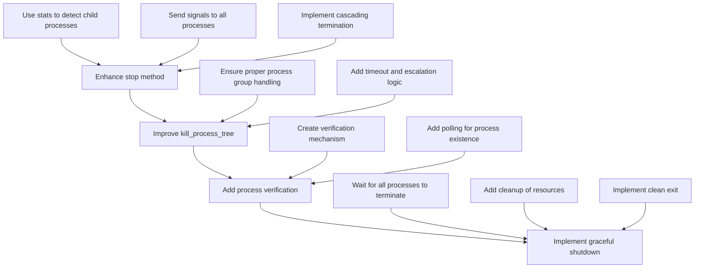

# Zinit Shutdown Functionality Improvement Plan

## Current Issues

1. **Incomplete Child Process Termination**: When services are stopped, child processes may remain running.
2. **Lack of Verification**: There's no verification that all processes are actually terminated.
3. **Improper Graceful Shutdown**: Zinit doesn't wait for all processes to terminate before exiting.

## Solution Overview

We'll implement a robust shutdown mechanism that:
1. Uses our stats functionality to detect all child processes
2. Properly manages process groups
3. Verifies all processes are terminated before Zinit exits

## Implementation Plan



## Detailed Implementation Steps

### 1. Enhance the `stop` Method in `LifecycleManager`

```rust
pub async fn stop<S: AsRef<str>>(&self, name: S) -> Result<()> {
    // Get service information
    let table = self.services.read().await;
    let service = table.get(name.as_ref())
        .ok_or_else(|| ZInitError::unknown_service(name.as_ref()))?;
    
    let mut service = service.write().await;
    service.set_target(Target::Down);
    
    // Get the main process PID
    let pid = service.pid;
    if pid.as_raw() == 0 {
        return Ok(());
    }
    
    // Get the signal to use
    let signal = signal::Signal::from_str(&service.service.signal.stop.to_uppercase())
        .map_err(|err| anyhow::anyhow!("unknown stop signal: {}", err))?;
    
    // Release the lock before potentially long-running operations
    drop(service);
    drop(table);
    
    // Get all child processes using our stats functionality
    let children = self.get_child_process_stats(pid.as_raw()).await?;
    
    // First try to stop the process group
    let _ = self.pm.signal(pid, signal);
    
    // Wait a short time for processes to terminate gracefully
    sleep(std::time::Duration::from_millis(500)).await;
    
    // Check if processes are still running and use SIGKILL if needed
    self.ensure_processes_terminated(pid.as_raw(), &children).await?;
    
    Ok(())
}
```

### 2. Add a New `ensure_processes_terminated` Method

```rust
async fn ensure_processes_terminated(&self, parent_pid: i32, children: &[ProcessStats]) -> Result<()> {
    // Check if parent is still running
    let parent_running = self.is_process_running(parent_pid).await?;
    
    // If parent is still running, send SIGKILL
    if parent_running {
        debug!("Process {} still running after SIGTERM, sending SIGKILL", parent_pid);
        let _ = self.pm.signal(Pid::from_raw(parent_pid), signal::Signal::SIGKILL);
    }
    
    // Check and kill any remaining child processes
    for child in children {
        if self.is_process_running(child.pid).await? {
            debug!("Child process {} still running, sending SIGKILL", child.pid);
            let _ = signal::kill(Pid::from_raw(child.pid), signal::Signal::SIGKILL);
        }
    }
    
    // Verify all processes are gone
    let mut retries = 5;
    while retries > 0 {
        let mut all_terminated = true;
        
        // Check parent
        if self.is_process_running(parent_pid).await? {
            all_terminated = false;
        }
        
        // Check children
        for child in children {
            if self.is_process_running(child.pid).await? {
                all_terminated = false;
                break;
            }
        }
        
        if all_terminated {
            return Ok(());
        }
        
        // Wait before retrying
        sleep(std::time::Duration::from_millis(100)).await;
        retries -= 1;
    }
    
    // If we get here, some processes might still be running
    warn!("Some processes may still be running after shutdown attempts");
    Ok(())
}
```

### 3. Add a Helper Method to Check if a Process is Running

```rust
async fn is_process_running(&self, pid: i32) -> Result<bool> {
    // Use sysinfo to check if process exists
    let mut system = System::new();
    let sys_pid = sysinfo::Pid::from(pid as usize);
    system.refresh_process(sys_pid);
    
    Ok(system.process(sys_pid).is_some())
}
```

### 4. Improve the `kill_process_tree` Method

```rust
#[cfg(target_os = "linux")]
async fn kill_process_tree(
    &self,
    mut dag: ProcessDAG,
    mut state_channels: HashMap<String, Watcher<State>>,
    mut shutdown_timeouts: HashMap<String, u64>,
) -> Result<()> {
    let (tx, mut rx) = mpsc::unbounded_channel();
    tx.send(DUMMY_ROOT.into())?;

    let mut count = dag.count;
    while let Some(name) = rx.recv().await {
        debug!("{} has been killed (or was inactive) adding its children", name);

        for child in dag.adj.get(&name).unwrap_or(&Vec::new()) {
            let child_indegree: &mut u32 = dag.indegree.entry(child.clone()).or_default();
            *child_indegree -= 1;

            debug!("decrementing child {} indegree to {}", child, child_indegree);

            if *child_indegree == 0 {
                let watcher = state_channels.remove(child);
                if watcher.is_none() {
                    // not an active service
                    tx.send(child.to_string())?;
                    continue;
                }

                let shutdown_timeout = shutdown_timeouts.remove(child);
                let lifecycle = self.clone_lifecycle();
                
                // Spawn a task to kill the service and wait for it to terminate
                let kill_task = tokio::spawn(Self::kill_wait_enhanced(
                    lifecycle,
                    child.to_string(),
                    tx.clone(),
                    watcher.unwrap(),
                    shutdown_timeout.unwrap_or(config::DEFAULT_SHUTDOWN_TIMEOUT),
                ));
                
                // Add a timeout to ensure we don't wait forever
                let _ = tokio::time::timeout(
                    std::time::Duration::from_secs(shutdown_timeout.unwrap_or(config::DEFAULT_SHUTDOWN_TIMEOUT) + 2),
                    kill_task
                ).await;
            }
        }

        count -= 1;
        if count == 0 {
            break;
        }
    }

    // Final verification that all processes are gone
    self.verify_all_processes_terminated().await?;

    Ok(())
}
```

### 5. Add an Enhanced `kill_wait` Method

```rust
#[cfg(target_os = "linux")]
async fn kill_wait_enhanced(
    self,
    name: String,
    ch: mpsc::UnboundedSender<String>,
    mut rx: Watcher<State>,
    shutdown_timeout: u64,
) {
    debug!("kill_wait {}", name);

    // Try to stop the service gracefully
    let stop_result = self.stop(name.clone()).await;
    
    // Wait for the service to become inactive or timeout
    let fut = timeout(
        std::time::Duration::from_secs(shutdown_timeout),
        async move {
            while let Some(state) = rx.next().await {
                if !state.is_active() {
                    return;
                }
            }
        },
    );
    
    match stop_result {
        Ok(_) => {
            let _ = fut.await;
        }
        Err(e) => error!("couldn't stop service {}: {}", name.clone(), e),
    }

    // Verify the service is actually stopped
    if let Ok(status) = self.status(&name).await {
        if status.pid != 0 {
            // Service is still running, try to kill it
            let _ = self.kill(&name, signal::Signal::SIGKILL).await;
        }
    }

    debug!("sending to the death channel {}", name.clone());
    if let Err(e) = ch.send(name.clone()) {
        error!(
            "error: couldn't send the service {} to the shutdown loop: {}",
            name, e
        );
    }
}
```

### 6. Add a Method to Verify All Processes are Terminated

```rust
async fn verify_all_processes_terminated(&self) -> Result<()> {
    // Get all services
    let table = self.services.read().await;
    
    // Check each service
    for (name, service) in table.iter() {
        let service = service.read().await;
        let pid = service.pid.as_raw();
        
        // Skip services with no PID
        if pid == 0 {
            continue;
        }
        
        // Check if the main process is still running
        if self.is_process_running(pid).await? {
            warn!("Service {} (PID {}) is still running after shutdown", name, pid);
            
            // Try to kill it with SIGKILL
            let _ = signal::kill(Pid::from_raw(pid), signal::Signal::SIGKILL);
        }
        
        // Check for child processes
        if let Ok(children) = self.get_child_process_stats(pid).await {
            for child in children {
                if self.is_process_running(child.pid).await? {
                    warn!("Child process {} of service {} is still running after shutdown", 
                          child.pid, name);
                    
                    // Try to kill it with SIGKILL
                    let _ = signal::kill(Pid::from_raw(child.pid), signal::Signal::SIGKILL);
                }
            }
        }
    }
    
    Ok(())
}
```

### 7. Update the `shutdown` and `reboot` Methods

```rust
pub async fn shutdown(&self) -> Result<()> {
    info!("shutting down");
    
    // Set the shutdown flag
    *self.shutdown.write().await = true;
    
    #[cfg(target_os = "linux")]
    {
        // Power off using our enhanced method
        let result = self.power(RebootMode::RB_POWER_OFF).await;
        
        // Final verification before exit
        self.verify_all_processes_terminated().await?;
        
        return result;
    }
    
    #[cfg(not(target_os = "linux"))]
    {
        // Stop all services
        let services = self.list().await?;
        for service in services {
            let _ = self.stop(&service).await;
        }
        
        // Verify all processes are terminated
        self.verify_all_processes_terminated().await?;
        
        if self.container {
            std::process::exit(0);
        } else {
            info!("System shutdown not supported on this platform");
            std::process::exit(0);
        }
    }
}
```

## Testing Plan

1. **Basic Service Termination**: Test that a simple service is properly terminated
2. **Child Process Termination**: Test that a service with child processes has all processes terminated
3. **Graceful Shutdown**: Test that Zinit exits cleanly after all services are stopped
4. **Edge Cases**:
   - Test with services that spawn many child processes
   - Test with services that spawn child processes that change their process group
   - Test with services that ignore SIGTERM

## Implementation Timeline

1. **Phase 1**: Enhance the `stop` method and add the helper methods (1-2 hours)
2. **Phase 2**: Improve the `kill_process_tree` and `kill_wait` methods (1-2 hours)
3. **Phase 3**: Update the `shutdown` and `reboot` methods (1 hour)
4. **Phase 4**: Testing and debugging (2-3 hours)