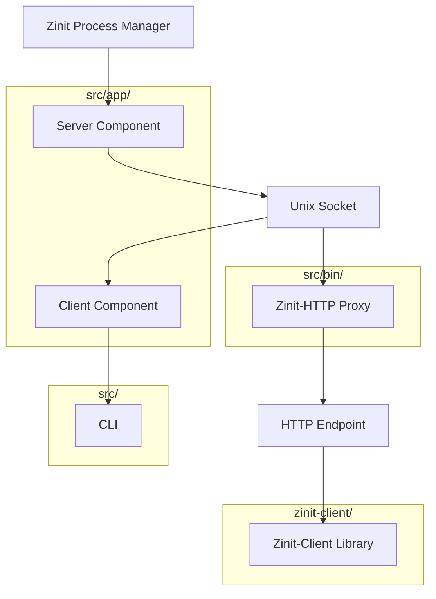

# API Restructuring Plan

## Current Structure Analysis

The current codebase has the following components:

1. **Zinit Process Manager**: The core process manager implemented in `src/zinit/` directory
2. **API Implementation** (`src/app/api.rs`): Contains both server and client code
   - `Api` struct: Server implementation handling both JSON-RPC and legacy protocol over Unix socket
   - `Client` struct: Client implementation for communicating with the server
3. **Zinit-client Library** (`zinit-client/src/lib.rs`): A separate client library providing a user-friendly interface
4. **Zinit-HTTP Proxy** (`src/bin/zinit-http.rs`): HTTP proxy forwarding JSON-RPC requests to the Zinit Unix socket
5. **CLI Interface** (`src/main.rs`): Command-line interface using the client to interact with Zinit

The main issue is that `src/app/api.rs` contains both server and client code, which should be separated for better maintainability and clearer architecture.

## Issues with Current Implementation

1. **Mixed Responsibilities**: The `api.rs` file handles both server and client functionality
2. **Duplicate Client Implementations**: There are two client implementations - one in `api.rs` and another in `zinit-client/src/lib.rs`
3. **Protocol Handling**: Both JSON-RPC and legacy protocol handling are mixed together

## Restructuring Plan

### 1. Create New File Structure

```
src/
├── app/
│   ├── mod.rs
│   ├── server.rs (new - extracted from api.rs)
│   └── client.rs (new - extracted from api.rs)
├── bin/
│   └── zinit-http.rs (existing)
└── ...

zinit-client/
└── src/
    └── lib.rs (existing - will be updated to use client.rs)
```

### 2. Split `api.rs` into Components

#### 2.1. `server.rs` - Server Component
- Move the `Api` struct and its implementation
- Keep JSON-RPC request handling
- Keep legacy protocol handling
- Keep Unix socket server implementation

#### 2.2. `client.rs` - Client Component
- Move the `Client` struct and its implementation
- Keep methods for interacting with the server
- Support both JSON-RPC and legacy protocol

### 3. Update References and Dependencies

- Update `app/mod.rs` to expose both server and client modules
- Update `zinit-client/src/lib.rs` to use the new client implementation
- Update `src/bin/zinit-http.rs` to use the new client implementation

### 4. Ensure Protocol Support

- Maintain support for the legacy protocol over Unix socket
- Maintain support for JSON-RPC over Unix socket
- Ensure the HTTP proxy correctly forwards JSON-RPC requests

## Detailed Implementation Plan

### Step 1: Create `server.rs`

Extract the server-related code from `api.rs`:
- JSON-RPC structures (request, response, error)
- Error codes
- `Api` struct and its implementation
- Server-side protocol handling

### Step 2: Create `client.rs`

Extract the client-related code from `api.rs`:
- `Client` struct and its implementation
- Client-side protocol handling
- Methods for interacting with the server

### Step 3: Update `mod.rs`

Update `app/mod.rs` to expose both modules:
```rust
pub mod server;
pub mod client;
```

### Step 4: Update References

- Update all references to `api::Api` to `server::Api`
- Update all references to `api::Client` to `client::Client`

### Step 5: Update `zinit-client/src/lib.rs`

- Refactor to use the new client implementation
- Ensure it supports both Unix socket and HTTP transport

### Step 6: Update `zinit-http.rs`

- Update to use the new client implementation
- Ensure it correctly forwards JSON-RPC requests

## Architecture Diagram



## Benefits of This Restructuring

1. **Clear Separation of Concerns**: Server and client code are separated
2. **Improved Maintainability**: Each component has a single responsibility
3. **Better Code Organization**: Related functionality is grouped together
4. **Reduced Duplication**: Client code is centralized
5. **Clearer Architecture**: The relationship between components is more explicit

## Implementation Details

### server.rs

The `server.rs` file will contain:

1. JSON-RPC structures:
   - `JsonRpcRequest`
   - `JsonRpcResponse`
   - `JsonRpcError`
   - `JsonRpcBatchRequest`

2. Error codes:
   - Standard JSON-RPC error codes
   - Custom error codes for Zinit

3. Legacy protocol structures:
   - `ZinitResponse`
   - `ZinitState`
   - `Status`

4. The `Api` struct and its implementation:
   - Constructor
   - Unix socket server
   - JSON-RPC request handling
   - Legacy protocol handling
   - Service management methods

### client.rs

The `client.rs` file will contain:

1. The `Client` struct and its implementation:
   - Constructor
   - Connection handling
   - JSON-RPC request handling
   - Legacy protocol handling
   - Service management methods

### mod.rs

The `mod.rs` file will be updated to:

```rust
pub mod server;
pub mod client;
```

And all functions that currently use `api::Api` or `api::Client` will be updated to use `server::Api` or `client::Client`.

### zinit-client/src/lib.rs

The `zinit-client/src/lib.rs` file will be updated to:

1. Import the new client implementation
2. Ensure it supports both Unix socket and HTTP transport
3. Maintain the same public API

### zinit-http.rs

The `zinit-http.rs` file will be updated to:

1. Import the new client implementation
2. Ensure it correctly forwards JSON-RPC requests

## Next Steps

1. Create the new files
2. Split the code
3. Update references
4. Test the implementation