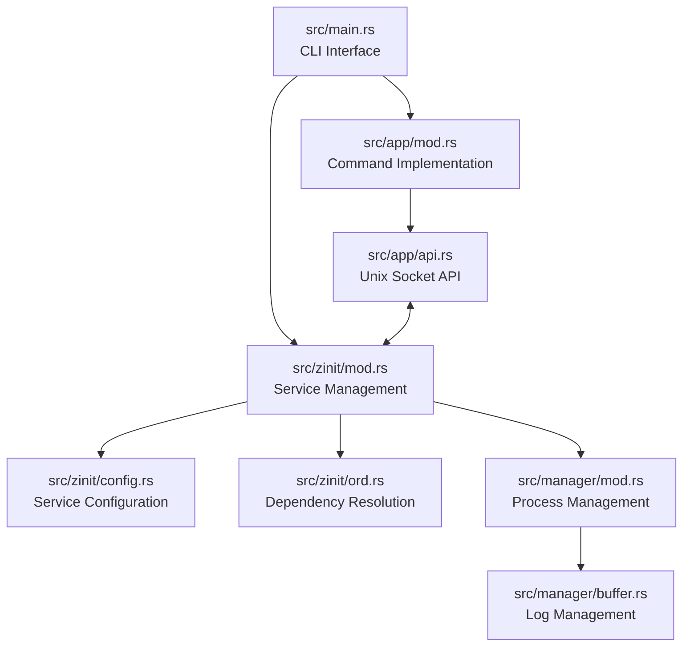

# Zinit Codebase Overview

Based on my analysis of the Zinit codebase, here's a comprehensive overview of what each file does and the relationships between the components.

## Project Purpose

Zinit is a lightweight PID 1 replacement (init system) written in Rust using the Tokio async runtime. It's designed to be a simple, reliable service manager for both system services and container environments, focusing on essential service management functionality.

## Core Components and Their Relationships

Here's a diagram showing the main components and their relationships:

## File Responsibilities

### 1. src/main.rs
- **Purpose**: Entry point for the application
- **Responsibilities**:
  - Parses command-line arguments using Clap
  - Dispatches to appropriate app functions based on commands
  - Handles top-level error handling
  - Defines subcommands (init, list, status, start, stop, etc.)

### 2. src/zinit/mod.rs
- **Purpose**: Core service management logic
- **Responsibilities**:
  - Implements the service state machine
  - Manages service lifecycle (start, stop, monitor)
  - Handles service dependencies
  - Coordinates system shutdown/reboot
  - Defines service states (Unknown, Blocked, Spawned, Running, etc.)
  - Defines target states (Up, Down)

### 3. src/zinit/config.rs
- **Purpose**: Service configuration parsing
- **Responsibilities**:
  - Defines the Service struct with all configuration options
  - Parses YAML configuration files
  - Validates service configurations
  - Loads service directory contents

### 4. src/zinit/ord.rs
- **Purpose**: Dependency resolution
- **Responsibilities**:
  - Builds a Directed Acyclic Graph (DAG) of service dependencies
  - Implements topological sorting for proper startup/shutdown order
  - Detects cycles in dependency relationships

### 5. src/manager/mod.rs
- **Purpose**: Process management
- **Responsibilities**:
  - Spawns and manages child processes
  - Handles process output (stdout/stderr)
  - Manages process signals
  - Collects exit status information
  - Creates process groups for proper signal handling

### 6. src/manager/buffer.rs
- **Purpose**: Log management
- **Responsibilities**:
  - Implements a circular buffer for storing service logs
  - Provides log streaming capabilities
  - Handles log retrieval via the API

### 7. src/app/api.rs
- **Purpose**: Unix socket API server
- **Responsibilities**:
  - Listens on a Unix socket for commands
  - Processes command requests
  - Returns results to clients in JSON format
  - Provides both server and client implementations

### 8. src/app/mod.rs
- **Purpose**: Command implementation

..