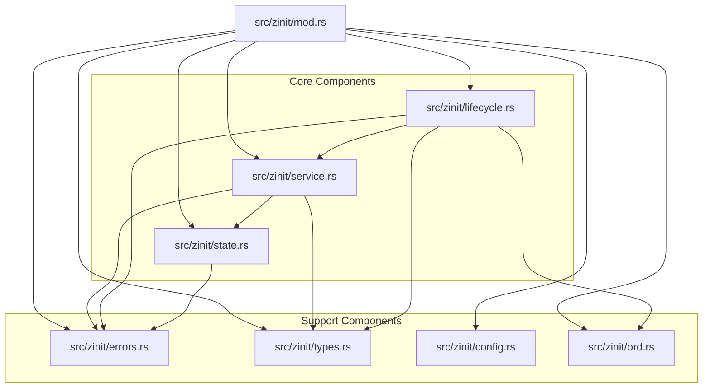

# Zinit Module Restructuring Plan

## Current State Analysis

After reviewing the zinit module, several issues have been identified that need to be addressed:

1. **Code Organization Issues**:
   - The `src/zinit/mod.rs` file is over 680 lines long, making it difficult to maintain
   - Multiple concerns are mixed in a single file
   - The ZInit struct has too many methods with varying responsibilities

2. **Separation of Responsibilities Issues**:
   - Service lifecycle management is mixed with other concerns
   - State management, dependency resolution, and process control are all intertwined
   - The `ZInit` struct handles too many responsibilities

3. **Error Handling Issues**:
   - Error handling is inconsistent across the codebase
   - Custom errors are defined but not used consistently
   - Some error contexts are missing

## Proposed Structure

The restructuring will follow a more object-oriented approach with clear separation between different service states and behaviors.



## Detailed File Breakdown

### 1. `src/zinit/mod.rs` (Reduced to ~100 lines)

This will become a thin coordination layer that:
- Re-exports public items from other modules
- Defines the main `ZInit` struct with minimal fields
- Implements only the high-level coordination methods
- Delegates implementation details to specialized modules

```rust
// Example of the new mod.rs structure
pub mod config;
pub mod errors;
pub mod lifecycle;
pub mod ord;
pub mod service;
pub mod state;
pub mod types;

// Re-export commonly used items
pub use config::{Service as ServiceConfig, Services, DEFAULT_SHUTDOWN_TIMEOUT};
pub use errors::ZInitError;
pub use service::{ZInitService, ZInitStatus};
pub use state::{State, Target};
pub use types::WaitStatusExt;

use crate::manager::ProcessManager;
use std::sync::Arc;
use tokio::sync::{Notify, RwLock};

#[derive(Clone)]
pub struct ZInit {
    pm: ProcessManager,
    services: Arc<RwLock<types::ServiceTable>>,
    notify: Arc<Notify>,
    shutdown: Arc<RwLock<bool>>,
    container: bool,
}

impl ZInit {
    pub fn new(cap: usize, container: bool) -> ZInit {
        // Implementation
    }
    
    pub fn serve(&self) {
        // Implementation
    }
    
    // High-level coordination methods only
    // Implementation details delegated to other modules
}
```

### 2. `src/zinit/types.rs` (New file, ~50 lines)

This file will contain common types and traits:
- Type aliases
- Utility structs like `Watched<T>`
- Extension traits

```rust
// Example of types.rs
use crate::zinit::service::ZInitService;
use std::collections::HashMap;
use std::sync::Arc;
use tokio::sync::RwLock;
use tokio::sync::watch;
use tokio_stream::{wrappers::WatchStream, StreamExt};

pub type ServiceTable = HashMap<String, Arc<RwLock<ZInitService>>>;
pub type Watcher<T> = WatchStream<Arc<T>>;

pub struct Watched<T> {
    v: Arc<T>,
    tx: watch::Sender<Arc<T>>,
}

impl<T> Watched<T>
where
    T: Send + Sync + 'static,
{
    pub fn new(v: T) -> Self {
        let v = Arc::new(v);
        let (tx, _) = watch::channel(Arc::clone(&v));
        Self { v, tx }
    }

    pub fn set(&mut self, v: T) {
        let v = Arc::new(v);
        self.v = Arc::clone(&v);
        // update the value even when there are no receivers
        self.tx.send_replace(v);
    }

    pub fn get(&self) -> &T {
        &self.v
    }

    pub fn watcher(&self) -> Watcher<T> {
        WatchStream::new(self.tx.subscribe())
    }
}

pub trait WaitStatusExt {
    fn success(&self) -> bool;
}

// Implementation
```

### 3. `src/zinit/errors.rs` (New file, ~50 lines)

This file will centralize error handling:
- Define the `ZInitError` enum
- Implement error conversion traits
- Add helper methods for error context

```rust
// Example of errors.rs
use thiserror::Error;

#[derive(Error, Debug)]
pub enum ZInitError {
    #[error("service name {name:?} unknown")]
    UnknownService { name: String },
    
    #[error("service {name:?} already monitored")]
    ServiceAlreadyMonitored { name: String },
    
    #[error("service {name:?} is up")]
    ServiceIsUp { name: String },
    
    #[error("service {name:?} is down")]
    ServiceIsDown { name: String },
    
    #[error("zinit is shutting down")]
    ShuttingDown,
    
    #[error("service state transition error: {message}")]
    InvalidStateTransition { message: String },
    
    #[error("dependency error: {message}")]
    DependencyError { message: String },
    
    #[error("process error: {message}")]
    ProcessError { message: String },
    
    // Additional error types
}

// Helper methods for creating errors with context
impl ZInitError {
    pub fn unknown_service<S: Into<String>>(name: S) -> Self {
        ZInitError::UnknownService { name: name.into() }
    }
    
    pub fn service_already_monitored<S: Into<String>>(name: S) -> Self {
        ZInitError::ServiceAlreadyMonitored { name: name.into() }
    }
    
    // Additional helper methods
}
```

### 4. `src/zinit/state.rs` (New file, ~100 lines)

This file will handle state management:
- Define the `State` and `Target` enums
- Implement state transition validation
- Add state-related utility methods

```rust
// Example of state.rs
use crate::zinit::errors::ZInitError;
use anyhow::Result;
use nix::sys::wait::WaitStatus;

#[derive(Clone, Debug, PartialEq)]
pub enum Target {
    Up,
    Down,
}

#[derive(Debug, PartialEq, Clone)]
pub enum State {
    /// Service is in an unknown state
    Unknown,
    
    /// Blocked means one or more dependencies hasn't been met yet
    Blocked,
    
    /// Service has been started, but it didn't exit yet, or we didn't run the test command
    Spawned,
    
    /// Service has been started, and test command passed
    Running,
    
    /// Service has exited with success state, only one-shot can stay in this state
    Success,
    
    /// Service exited with this error, only one-shot can stay in this state
    Error(WaitStatus),
    
    /// The service test command failed
    TestFailure,
    
    /// Failure means the service has failed to spawn in a way that retrying won't help
    Failure,
}

impl State {
    /// Validate if a transition from the current state to the new state is valid
    pub fn can_transition_to(&self, new_state: &State) -> bool {
        match (self, new_state) {
            // Define valid state transitions
            (State::Unknown, _) => true,
            (State::Blocked, State::Spawned) => true,
            (State::Blocked, State::Failure) => true,
            (State::Spawned, State::Running) => true,
            (State::Spawned, State::TestFailure) => true,
            (State::Spawned, State::Error(_)) => true,
            (State::Spawned, State::Success) => true,
            (State::Running, State::Success) => true,
            (State::Running, State::Error(_)) => true,
            (_, State::Unknown) => true,
            (_, State::Blocked) => true,
            _ => false,
        }
    }
    
    /// Attempt to transition to a new state, validating the transition
    pub fn transition_to(&self, new_state: State) -> Result<State, ZInitError> {
        if self.can_transition_to(&new_state) {
            Ok(new_state)
        } else {
            Err(ZInitError::InvalidStateTransition { 
                message: format!("Invalid transition from {:?} to {:?}", self, new_state) 
            })
        }
    }
    
    /// Check if the state is considered "active" (running or in progress)
    pub fn is_active(&self) -> bool {
        matches!(self, State::Running | State::Spawned)
    }
    
    /// Check if the state is considered "terminal" (success or failure)
    pub fn is_terminal(&self) -> bool {
        matches!(self, State::Success | State::Error(_) | State::Failure)
    }
}
```

### 5. `src/zinit/service.rs` (New file, ~150 lines)

This file will handle service-specific logic:
- Define the `ZInitService` and `ZInitStatus` structs
- Implement service-specific methods
- Handle service state management

```rust
// Example of service.rs
use crate::zinit::config;
use crate::zinit::errors::ZInitError;
use crate::zinit::state::{State, Target};
use crate::zinit::types::Watched;
use anyhow::{Context, Result};
use nix::unistd::Pid;

pub struct ZInitService {
    pub pid: Pid,
    pub service: config::Service,
    pub target: Target,
    pub scheduled: bool,
    state: Watched<State>,
}

pub struct ZInitStatus {
    pub pid: Pid,
    pub service: config::Service,
    pub target: Target,
    pub scheduled: bool,
    pub state: State,
}

impl ZInitService {
    pub fn new(service: config::Service, state: State) -> ZInitService {
        ZInitService {
            pid: Pid::from_raw(0),
            state: Watched::new(state),
            service,
            target: Target::Up,
            scheduled: false,
        }
    }
    
    pub fn status(&self) -> ZInitStatus {
        ZInitStatus {
            pid: self.pid,
            state: self.state.get().clone(),
            service: self.service.clone(),
            target: self.target.clone(),
            scheduled: self.scheduled,
        }
    }
    
    pub fn set_state(&mut self, state: State) -> Result<()> {
        let current_state = self.state.get().clone();
        let new_state = current_state.transition_to(state)
            .context("Failed to transition service state")?;
        
        self.state.set(new_state);
        Ok(())
    }
    
    pub fn set_target(&mut self, target: Target) {
        self.target = target;
    }
    
    pub fn get_state(&self) -> &State {
        self.state.get()
    }
    
    pub fn state_watcher(&self) -> crate::zinit::types::Watcher<State> {
        self.state.watcher()
    }
    
    pub fn is_active(&self) -> bool {
        self.state.get().is_active()
    }
    
    pub fn is_terminal(&self) -> bool {
        self.state.get().is_terminal()
    }
    
    pub fn set_pid(&mut self, pid: Pid) {
        self.pid = pid;
    }
    
    pub fn clear_pid(&mut self) {
        self.pid = Pid::from_raw(0);
    }
}
```

### 6. `src/zinit/lifecycle.rs` (New file, ~200 lines)

This file will handle service lifecycle management:
- Implement methods for starting, stopping, and monitoring services
- Handle dependency management
- Manage process spawning and monitoring

```rust
// Example of lifecycle.rs
use crate::manager::{Log, Process, ProcessManager};
use crate::zinit::config;
use crate::zinit::errors::ZInitError;
use crate::zinit::ord::{service_dependency_order, ProcessDAG, DUMMY_ROOT};
use crate::zinit::service::ZInitService;
use crate::zinit::state::{State, Target};
use crate::zinit::types::{ServiceTable, Watcher};
use anyhow::{Context, Result};
use nix::sys::signal;
use std::collections::HashMap;
use std::str::FromStr;
use std::sync::Arc;
use tokio::sync::{mpsc, Notify, RwLock};
use tokio::time;

pub struct LifecycleManager {
    pm: ProcessManager,
    services: Arc<RwLock<ServiceTable>>,
    notify: Arc<Notify>,
    shutdown: Arc<RwLock<bool>>,
}

impl LifecycleManager {
    pub fn new(pm: ProcessManager, services: Arc<RwLock<ServiceTable>>, 
               notify: Arc<Notify>, shutdown: Arc<RwLock<bool>>) -> Self {
        Self {
            pm,
            services,
            notify,
            shutdown,
        }
    }
    
    pub async fn start_service(&self, name: &str) -> Result<()> {
        if *self.shutdown.read().await {
            return Err(ZInitError::ShuttingDown.into());
        }
        
        // Implementation
        Ok(())
    }
    
    pub async fn stop_service(&self, name: &str) -> Result<()> {
        let table = self.services.read().await;
        let service = table.get(name).ok_or_else(|| ZInitError::unknown_service(name))?;
        
        // Implementation
        Ok(())
    }
    
    pub async fn monitor_service(&self, name: &str, service_config: config::Service) -> Result<()> {
        if *self.shutdown.read().await {
            return Err(ZInitError::ShuttingDown.into());
        }
        
        // Implementation
        Ok(())
    }
    
    pub async fn can_schedule(&self, service: &config::Service) -> bool {
        // Implementation
        true
    }
    
    async fn test_service(&self, name: &str, cfg: &config::Service) -> Result<bool> {
        // Implementation
        Ok(true)
    }
    
    async fn watch_service(&self, name: String, service: Arc<RwLock<ZInitService>>) {
        // Implementation
    }
    
    // Additional lifecycle methods
}
```

### 7. `src/zinit/config.rs` (Existing file, minimal changes)

This file will continue to handle configuration:
- Keep configuration parsing logic
- Add validation methods
- Improve error handling

### 8. `src/zinit/ord.rs` (Existing file, minimal changes)

This file will continue to handle dependency resolution:
- Keep dependency resolution logic
- Improve documentation
- Enhance error handling

## Implementation Approach

The implementation will be done in phases:

### Phase 1: Create New File Structure
1. Create the new files
2. Move code to appropriate files without changing functionality
3. Update imports and exports

### Phase 2: Refactor for Object-Orientation
1. Enhance the service and state objects
2. Implement proper state transitions
3. Create the lifecycle manager

### Phase 3: Improve Error Handling
1. Enhance error types
2. Add context to errors
3. Implement consistent error handling patterns

### Phase 4: Testing and Documentation
1. Ensure all functionality is preserved
2. Add comprehensive documentation
3. Update examples

## Benefits of This Restructuring

1. **Improved Object-Orientation**
   - Clear separation between different service states and behaviors
   - Better encapsulation of implementation details
   - More intuitive object model

2. **Enhanced Maintainability**
   - Smaller, focused files are easier to understand and maintain
   - Clear separation of concerns makes the code more modular
   - Reduced cognitive load when working on specific components

3. **Better Error Handling**
   - Centralized error definitions
   - More context in error messages
   - Consistent error handling patterns

4. **Preserved Functionality**
   - All existing functionality will be maintained
   - External API will remain compatible
   - No regression in behavior